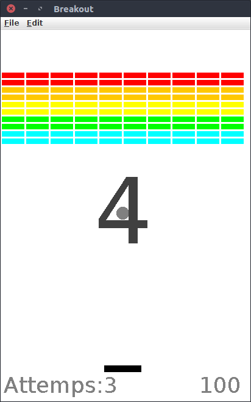

# NaUKMA Java Project 2 Breakout

Study project at NaUKMA (National University of Kyiv Mohyla Academy) Java
course. This project was done in the team with another student Viktoria Kozopas.

## Project goal and requirements

The goal was to create graphic Breakout game using graphics from 
[ACM Java Library]. The game was expected to support the number of constants,
such as window height and width, ball speed, number of bricks, etc. The ball
had to start moving in the random direction (by naturally not horizontal)
after the countdown. Game had to support the number of lives.

Also, we were expected to add some our own features, for example to improve
design. Our team decided not to change standard graphics, but to improve
physics behaviour of objects - especially to make ball behave naturally when
touching bricks.

## Implementation

The game starts with countdown:

There are a counter for remaining bricks and remaining lives:

When all lives are gone, game is over:

Window and game settings can be configured:

When all bricks are hit, you wins:

## ACM Java Library usage

The [ACM Java Library] usage is regulated by
[the license][ACM Java Library License].

[ACM Java Library]: https://cs.stanford.edu/people/eroberts/jtf/
[ACM Java Library License]: https://cs.stanford.edu/people/eroberts/jtf/documents/License.pdf
